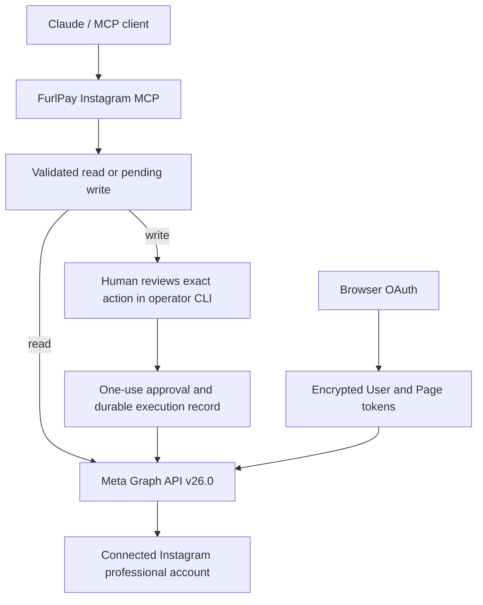

# FurlPay Instagram MCP

Official Instagram tools for Claude Desktop and other MCP clients, with OAuth, account ownership checks, and human approval before publishing or moderation.

<p>
  
  
  
  
  
  
</p>

This standalone repository uses **Instagram API with Facebook Login**, verified against official Meta documentation on September 27–28, 2026. It serves one Instagram Business or Creator account linked to a Facebook Page. Instagram Login is a separately supported Meta product; this release documents its differences and implements the Facebook Login flow for hashtag, mentions, publishing, and analytics coverage.

The implementation is validated with mocked Meta responses and real MCP SDK transport tests. Connecting a live account still requires your Meta app, approved permissions/features, suitable Page roles, and deployment acceptance checks. No live Instagram account was used in the automated test suite.

## What it does

- Account profiles, owned media, active Stories, Reels, comments, replies, and performance insights.
- Hashtag content research and webhook-driven mentions, using current documented APIs.
- Approved image, Reel, carousel, and Business-account Story publishing with persisted container processing.
- Approved comments, replies, hiding, deletion, media deletion, and restricted like/unlike operations.
- Conversation reads and approved replies within a verified 24-hour inbound messaging window, with a configured human support route.
- Signed webhooks, encrypted credential/content storage, durable approvals and audit events, bounded pagination, safe read retries, and circuit breaking.

**[Complete tool / endpoint / permission table →](docs/TOOLS.md)** · **[Official API research and all 27 legacy classifications →](docs/INSTAGRAM_API.md)** · **[Security and operations →](docs/OPERATIONS.md)**



## Install

Requires Node.js 24 or later. SQLite is supplied by Node; no database server is needed. Keep the database on a local durable disk, outside cloud-sync folders and outside this checkout.

```sh
git clone https://github.com/FurlPay/furlpay-instagram-mcp.git
cd furlpay-instagram-mcp
npm ci --ignore-scripts
npm run build
```

Copy `.env.example` to `.env` (`Copy-Item .env.example .env` in PowerShell), fill in your Meta credentials, and generate the encryption key:

```sh
node dist/cli.js keygen
npm run connect
npm run status
```

`connect` prints a one-use localhost link. Open it in a browser, authorize Meta, and return to the terminal. OAuth codes and tokens are exchanged server-side and encrypted before storage. `status` validates the token and prints only account metadata, granted permissions, connection date, and expiration.

## Configure the Meta app

1. Create/configure the Meta app for **Instagram API with Facebook Login**. Link the intended Instagram professional account to a Facebook Page. The authorizing person needs the relevant Page tasks.
2. Configure Facebook Login / Facebook Login for Business for the server-side authorization-code flow and a **User access token**. Set `FACEBOOK_LOGIN_CONFIG_ID` if your dashboard uses a login configuration.
3. Register the exact `INSTAGRAM_REDIRECT_URI`. The operator bootstrap listener accepts loopback HTTP only. For a remote server, use a secure local port-forward to the same loopback callback rather than exposing it publicly.
4. Request `instagram_basic`, `pages_show_list`, and `pages_read_engagement`. Add only the publishing, comments, insights, messaging, deletion, engagement, or webhook scopes you need and have approved. See [the permission matrix](docs/INSTAGRAM_API.md#permissions-and-access-requirements).
5. Set `FACEBOOK_PAGE_ID` when more than one Page is authorized. The connector verifies the Page belongs to the token and resolves its linked Instagram account.
6. Complete the required app privacy/deletion URLs, business verification, App Review, and Advanced Access for accounts outside app roles. Hashtag research needs **Instagram Public Content Access** feature approval in addition to OAuth scopes.

Facebook long-lived User tokens have finite token/data-access lifetimes. This connector revalidates them and requires OAuth reconnection on expiry or revocation. It does not apply Instagram Login's refresh endpoint to Facebook tokens. Run `npm run disconnect` to remove local credentials, pending approvals, and webhook content; remove the app in Facebook **Business Integrations** to revoke the provider grant. [Token lifecycle details](docs/OPERATIONS.md#oauth-and-token-lifecycle).

## Connect Claude Desktop

Build first, then add an MCP server entry using absolute paths. Keep the populated `.env` readable only by the service/operator account.

```json
{
  "mcpServers": {
    "furlpay-instagram": {
      "command": "node",
      "args": [
        "--env-file=C:/absolute/path/furlpay-instagram-mcp/.env",
        "C:/absolute/path/furlpay-instagram-mcp/dist/cli.js",
        "serve"
      ]
    }
  }
}
```

The stdio server reserves stdout for MCP. Logs and operator messages use stderr. The same launch command works with other clients supporting stdio MCP.

For clients that support an explicitly configured bearer header, set a separate `MCP_HTTP_BEARER_TOKEN` and run `npm run http`; connect to `/mcp` using `Authorization: Bearer ...`. Put remote HTTP behind HTTPS and set `MCP_ALLOWED_ORIGIN` to the exact external origin. This optional transport uses stateless Streamable HTTP with a service credential. It is **not** an OAuth 2.1 authorization server for Claude's hosted connector flow; use stdio for Claude Desktop or an independently configured MCP auth gateway. [HTTP deployment](docs/OPERATIONS.md#http-and-webhook-deployment).

## Human approval and publishing

Ask the agent to prepare a post, reply, or moderation action. Its first write-tool call returns `INSTAGRAM_APPROVAL_REQUIRED` and an approval ID; no Instagram mutation has happened. In a separate trusted operator terminal:

```sh
npm run approve -- APPROVAL_UUID
```

Review the exact account, tool, and arguments, then type the displayed `APPROVE <UUID>` phrase. Piped approval is refused. Ask the agent to repeat the identical tool arguments with `approval_id`. Approvals expire after 15 minutes; changing any approved argument requires a new approval. Destructive tools also require `confirmation: "DELETE_COMMENT"` or `"DELETE_MEDIA"` in their schema.

Publishing creates containers, checks processing, and publishes only `FINISHED` containers. A `processing` result includes a job ID and next check time; repeat the same approved tool after that time to resume. The server enforces a one-minute polling interval and a five-minute processing budget. A completed approval returns its stored result on replay. An ambiguous write becomes `unknown` and requires human reconciliation; neither restart nor repeated tool calls can blindly create a duplicate post.

The approval CLI is an operator trust boundary. Keep its terminal, database, and encryption key outside the AI agent's shell/filesystem permissions. A process with the operator's OS privileges can modify local state; a TTY prompt is not hardware-backed proof of a human.

## Webhooks and community replies

Run the HTTP receiver behind HTTPS. Configure `/webhooks/instagram` in Meta, set `META_WEBHOOK_VERIFY_TOKEN`, and subscribe only supported fields. The `instagram_subscribe_webhooks` tool changes the linked Page subscription after human approval. GET challenges and raw-body HMAC-SHA256 signatures are verified; events are account-bound, encrypted, deduplicated, and stored before acknowledgement.

The event inbox supports comments, live comments, mentions, Story identity notifications, and inbound Instagram messages. It does not invent a generic media-change event. Read mentions from the inbox, then resolve the specific media or comment ID with the mention tools.

Messaging permissions are optional. Before sending, configure a working `INSTAGRAM_HUMAN_SUPPORT_URL` and include that URL in the proposed action. Every sent message appends the human support footer and must fit 1,000 UTF-8 bytes. A signed Instagram inbound event less than 24 hours old is required at execution time. Cold outreach and the HUMAN_AGENT exception for automated replies are not provided.

## FurlPay workflows

| Marketing task | Supported workflow |
| --- | --- |
| Research stablecoin content | Search an exact hashtag, read a bounded recent/top page, analyze returned captions |
| Find mentions of FurlPay | Receive mention webhooks, resolve their media/comment IDs |
| Publish approved content | Draft → AI review → operator approval → container processing → publish → insights |
| Find unanswered comments | Read owned-media comments, inspect their replies |
| Compare post/Reel performance | Read current type-compatible media insights and account date ranges |
| Check integration health | Operator `status` command and HTTP `/healthz` |

This is a new standalone connector repository; it contains no existing FurlPay billing, revenue, or admin application. The operator CLI supplies connection status and approvals. An existing FurlPay admin application can integrate the same account-bound approval and status services while retaining its own authenticated identity boundary.

## Development and validation

```sh
npm run typecheck
npm run lint
npm run test:unit
npm run test:integration
npm run build
npm run docs:check
```

Tests mock Meta and cover OAuth, token validation, account/media reads, pagination, ownership, comments, publishing, insights, webhook security, rate limits, timeouts, permissions, invalid IDs, and write approvals. Integration tests exercise the official MCP SDK and real local HTTP boundaries. CI is configured for Linux and Windows with Node 24. See [the validation report](docs/VALIDATION.md) for the exact locally executed results, hosted CI startup failure, and deployment limitations.

## Limits to keep in view

- No personal-account access, arbitrary user search, follower graph, location/geography media search, popular feed, or scraping.
- `instagram_publish_video` publishes a **Reel**. `media_type=VIDEO` is used only for documented carousel video children.
- The current profile reference does not provide `account_type`; the connector does not infer it. Story publication requires explicit Business-account confirmation, with Meta enforcing eligibility.
- `views` replaces deprecated impressions metrics. Empty insights remain unavailable, not zero. The capability map deliberately omits unsupported demographic and crossposting combinations.
- API field availability, account thresholds, processing, App Review, and actual rate quotas remain controlled by Meta. Hosted media URLs must stay reachable while Meta processes them.

MIT licensed. See [SECURITY.md](SECURITY.md) for reporting security issues.
