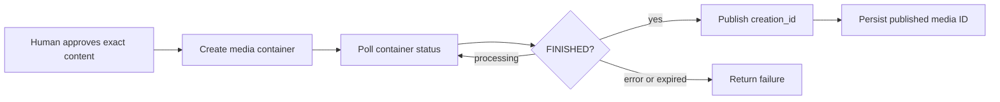

# Instagram API capabilities and legacy compatibility

Research completed **September 27–28, 2026**, using official Meta documentation before endpoint implementation. See [RESEARCH.md](./RESEARCH.md) for the endpoint evidence, field restrictions, and conflicting examples encountered during verification. No legacy endpoint is forwarded or emulated.

## API product used

This connector uses **Instagram API with Facebook Login**, with **Graph API v26.0** at `https://graph.facebook.com/v26.0`. The Instagram Graph API is the professional-account API model, not the historical Instagram v1 API. Meta lists v26.0 as released July 29, 2026; older Instagram examples still mention v25.0. The central Graph version table governs the selected version. [Meta version table](https://developers.facebook.com/docs/graph-api/changelog/versions)

Eligible accounts are **Instagram Business and Creator accounts connected to a Facebook Page** that the authorizing Facebook user can manage. Personal accounts, arbitrary users' private media, follower lists, and general Instagram search are not made accessible by granting the connector a token. Publishing Stories has an additional **Business account** requirement. [Facebook Login API](https://developers.facebook.com/documentation/instagram-platform/instagram-api-with-facebook-login)

Instagram API with Instagram Login is a separate supported product for professional accounts without a linked Page. It uses `graph.instagram.com`, Instagram User tokens, and `instagram_business_basic`, `instagram_business_content_publish`, `instagram_business_manage_comments`, `instagram_business_manage_messages`, and `instagram_business_manage_insights`, according to the operation. It supports insights and certain mentions functionality today. **Instagram Login is researched but not implemented in this release**; its refresh mechanism and scope names must not be mixed with Facebook Login. [Instagram Login](https://developers.facebook.com/documentation/instagram-platform/instagram-api-with-instagram-login), [Insights requirements](https://developers.facebook.com/documentation/instagram-platform/insights)

## Permissions and access requirements

| Permission or feature | Purpose |
| --- | --- |
| `instagram_basic` | Read professional account and supported media data |
| `pages_read_engagement` | Required Page-linked access for the principal Instagram operations |
| `pages_show_list` | Discover Pages available to the authorizing Facebook user |
| `instagram_manage_comments` | Read, create, reply to, hide, and delete supported comments; tags and mentions |
| `instagram_content_publish` | Create and publish media containers; inspect publishing usage |
| `instagram_manage_insights` | Account and owned-media analytics |
| `instagram_manage_contents` | Delete supported owned Instagram media; added in 2025 |
| `instagram_manage_engagement` | Restricted like/unlike API introduced in 2026 |
| `instagram_manage_messages` | Instagram messaging through Messenger Platform |
| `pages_manage_metadata` | Subscribe the linked Page to webhook notifications and required messaging access |
| `pages_messaging` | Additional permission listed by the direct conversation/messages reference |
| **Instagram Public Content Access** | App Review feature approval required for hashtag discovery; this is not an OAuth scope |

Permissions are requested and enforced per operation. Some Business Manager role arrangements additionally require `ads_read` or `ads_management`; use the requirement for the specific endpoint and Meta's access review. Standard Access is intended for accounts owned/managed by app participants; serving other businesses requires Advanced Access and applicable business verification/App Review. [Platform overview](https://developers.facebook.com/documentation/instagram-platform/overview), [App Review](https://developers.facebook.com/documentation/instagram-platform/app-review)

Granting an OAuth permission does not grant an AI agent unrestricted write access. The connector's local actor authorization, resource ownership checks, approval mechanism, and any destructive confirmation must also succeed.

## Account and resource model

The connected Instagram account is discovered from an authorized Facebook Page during OAuth. Tools operate on that stored connection. IDs supplied for media or comments are validated and checked against the connected account before account-bound reads or mutations.

The documented profile fields include `id`, `username`, `name`, `profile_picture_url`, `followers_count`, `follows_count`, `media_count`, `biography`, and `website`. The current IG User reference does **not** document `account_type`. The connector must omit unavailable fields. The Page field named `instagram_business_account` can represent an eligible professional account and is not proof that the account is Business rather than Creator. [IG User reference](https://developers.facebook.com/documentation/instagram-platform/instagram-graph-api/reference/ig-user)

Media ownership is checked using `GET /MEDIA_ID?fields=owner,...`. The `owner` field is provided for the account's own media; absent ownership fails closed. A comment's `media.id` identifies its parent media for the corresponding ownership check. A comment's author is not sufficient authority to delete it: Meta restricts deletion to the owner of the media on which it appears. [Media fields](https://developers.facebook.com/documentation/instagram-platform/reference/instagram-media), [Comment reference](https://developers.facebook.com/documentation/instagram-platform/instagram-graph-api/reference/ig-comment)

## Media, publishing, and deletion

Account media uses `GET /IG_ID/media`; a particular media object uses `GET /MEDIA_ID`. Carousel children are available through the documented `children` edge or field expansion. Reels appear in the media collection as `media_type=VIDEO` and `media_product_type=REELS`; a Reels listing filters the existing media page without inventing a `/reels` endpoint. Missing fields, hidden counts, and copyright-restricted URLs are not synthesized. [Media reference](https://developers.facebook.com/documentation/instagram-platform/reference/instagram-media)

Publishing follows this sequence:



| Output | Container flow |
| --- | --- |
| Image | `POST /IG_ID/media` with publicly available JPEG `image_url` |
| Reel / standalone video | `POST /IG_ID/media` with `media_type=REELS` and `video_url` |
| Carousel | Create 2–10 image/video child containers with `is_carousel_item=true`; create parent `media_type=CAROUSEL` with child IDs |
| Story | `POST /IG_ID/media` with `media_type=STORIES` and supported media URL; Business accounts only |

All flows then inspect `GET /CONTAINER_ID?fields=status_code` and publish using `POST /IG_ID/media_publish` with `creation_id`. Video processing must finish before publishing. `ERROR` and `EXPIRED` are terminal; `IN_PROGRESS` is not a successful publication. Meta recommends polling once a minute for up to five minutes. Containers expire after 24 hours. A lost response to a write is an ambiguous outcome; automatically repeating publication could duplicate content. [Content publishing](https://developers.facebook.com/documentation/instagram-platform/content-publishing)

Standalone `media_type=VIDEO` was removed in 2023; videos publish through Reels. Video carousel children have their own supported flow. JPEGs are limited to 8 MB; format, dimensions, codecs, duration, and accessibility of the media URL remain subject to Meta validation. The connector can validate URL structure and allowed inputs but cannot promise the content behind a URL satisfies every media specification. [Media creation reference](https://developers.facebook.com/documentation/instagram-platform/instagram-graph-api/reference/ig-user/media)

The current publishing guide inconsistently states both 100 and 50 posts in a rolling day. The implementation uses the account's `GET /IG_ID/content_publishing_limit` response and Meta's actual rejection rather than hardcoding one contradictory number. The creation reference separately documents 400 containers per rolling day. [Quota reference](https://developers.facebook.com/documentation/instagram-platform/instagram-graph-api/reference/ig-user/content_publishing_limit)

**Deletion is currently supported.** Since November 2025, `DELETE /MEDIA_ID` with `instagram_manage_contents` can remove non-ad posts, Stories, Reels, and entire carousel albums through Facebook Login. Individual carousel children cannot be deleted. Deletion must require resource ownership, explicit approval, and destructive-action confirmation. [Media deletion reference](https://developers.facebook.com/documentation/instagram-platform/reference/instagram-media#delete)

## Comments

The current reference explicitly supports top-level creation via `POST /MEDIA_ID/comments` with `message`, even though the shorter comment moderation guide only highlights replies. Reading is `GET /MEDIA_ID/comments`, replies use `GET` or `POST /COMMENT_ID/replies`, and deletion uses `DELETE /COMMENT_ID`. No legacy `/media/MEDIA_ID/comments/COMMENT_ID` route is sent to Meta. [Media comments](https://developers.facebook.com/documentation/instagram-platform/instagram-graph-api/reference/ig-media/comments), [Replies](https://developers.facebook.com/documentation/instagram-platform/instagram-graph-api/reference/ig-comment/replies)

Comment reads return top-level comments, at most 50 per page; replying comments require the replies edge or explicit expansion. Live-media mutation restrictions apply. A comment discovered in an unrelated hashtag result is not a resource the connected account is authorized to manage.

## Insights and metric lifecycle

Media analytics uses `GET /MEDIA_ID/insights`; account analytics uses `GET /IG_ID/insights`. The selected metric must match the resource and parameter combination. Unsupported metrics return a connector capability error rather than being forwarded optimistically.

| Resource | Current relevant metrics |
| --- | --- |
| Feed media | `comments`, `follows`, `likes`, `profile_activity`, `profile_visits`, `reach`, `reposts`, `saved`, `shares`, `total_interactions`, `views` |
| Reels | `comments`, `likes`, `reach`, `reposts`, `saved`, `shares`, `total_interactions`, `views`, `ig_reels_avg_watch_time`, `ig_reels_video_view_total_time`, `reels_skip_rate` |
| Stories | `follows`, `link_clicks`, `navigation`, `profile_activity`, `profile_visits`, `reach`, `replies`, `reposts`, `shares`, `total_interactions`, `views` |
| Account interaction totals | `accounts_engaged`, `comments`, `follows_and_unfollows`, `likes`, `profile_links_taps`, `reach`, `replies`, `reposts`, `saves`, `shares`, `total_interactions`, `views` |

Media metrics use lifetime aggregation. `profile_activity` permits `action_type` breakdown, and `navigation` permits `story_navigation_action_type`; arbitrary combinations are invalid. Facebook Login also supports aggregated `total_comments`, `total_likes`, and `total_views` for documented media types. Facebook/crossposted view metrics have additional sharing requirements. Album children have no independent insights. [Media insight metrics](https://developers.facebook.com/documentation/instagram-platform/reference/instagram-media/insights)

Account interaction totals generally require `period=day&metric_type=total_value`; `reach` also permits `time_series`. Demographics have separate lifetime/timeframe/breakdown rules and minimum audience thresholds. `followers_count` is a profile field; it is not renamed to an invented analytics metric. Unknown or deprecated combinations fail validation. [Account insight metrics](https://developers.facebook.com/documentation/instagram-platform/api-reference/instagram-user/insights)

Insight data can be delayed by 48 hours; empty data means unavailable, not zero. Stories have a 24-hour insight window and low-viewer/region restrictions. Preserve unavailable results and context when comparing posts. Do not automatically turn absent values into zero engagement.

Account `impressions` was removed for all versions in April 2025. Older `video_views`, `engagement`, carousel-specific legacy metrics, and profile-contact time-series metrics have also been deprecated. Prefer documented `views`, `total_interactions`, and `profile_links_taps` as appropriate. Media impressions have historical exceptions but are deliberately excluded from the connector's current metric set. [Insights changelog](https://developers.facebook.com/documentation/instagram-platform/changelog)

## Hashtags, mentions, and Stories

Hashtag discovery is a Facebook Login capability requiring **Instagram Public Content Access** review. `GET /ig_hashtag_search?user_id=IG_ID&q=TAG` resolves a hashtag ID. `GET /HASHTAG_ID/recent_media?user_id=IG_ID` and `/top_media` return supported public media. This is exact hashtag lookup, not unrestricted keyword search. Querying is limited to 30 unique hashtags per connected professional account in a rolling seven-day period. Hashtag discovery does not permit commenting on the results. [Hashtag guide](https://developers.facebook.com/documentation/instagram-platform/instagram-api-with-facebook-login/hashtag-search)

Recent hashtag media covers only the previous 24 hours, omits usernames, and has a maximum page size of 50. Sensitive/offensive queries may return generic Meta errors. No location/geography scraping supplements those results. [Recent-media restrictions](https://developers.facebook.com/documentation/instagram-platform/instagram-graph-api/reference/ig-hashtag/recent-media)

Mentions are obtained from signed webhook events and then resolved by ID:

```text
GET /IG_ID?fields=mentioned_media.media_id(MEDIA_ID){id,caption,media_type,...}
GET /IG_ID?fields=mentioned_comment.comment_id(COMMENT_ID){id,text,timestamp,...}
```

The media or comment ID is required. These are field expansions on the connected account, not `/mentions` GET listing endpoints. `GET /IG_ID/tags` lists publicly tagged media separately. Caption/comment mentions on Stories are unsupported, and private-account mentions may not produce webhook events. [Mentions guide](https://developers.facebook.com/documentation/instagram-platform/instagram-api-with-facebook-login/mentions), [Mentioned media](https://developers.facebook.com/documentation/instagram-platform/instagram-graph-api/reference/ig-user/mentioned_media), [Mentioned comment](https://developers.facebook.com/documentation/instagram-platform/instagram-graph-api/reference/ig-user/mentioned_comment)

Story reads use `GET /IG_ID/stories`, return active Stories only, and exclude live and reshared Stories. Publishing Stories requires a Business account. A trusted operator may configure verified business eligibility, but that declaration is not returned as an API-provided profile field. Meta still validates eligibility. [Stories](https://developers.facebook.com/documentation/instagram-platform/instagram-graph-api/reference/ig-user/stories)

## Webhooks and messaging

Register the callback and chosen Instagram object fields in the App Dashboard; subscribe the linked Facebook **Page**, using a Page token and `POST /PAGE_ID/subscribed_apps`. Validate the challenge's verification token and validate `X-Hub-Signature-256` against raw bytes using the Meta app secret. Authenticate and bind events to stored connections before normalizing or dispatching them. [Webhook setup](https://developers.facebook.com/documentation/instagram-platform/webhooks/setup)

Supported notifications depend on the API configuration. Facebook Login includes `comments`, `live_comments`, `mentions`, `story_insights`, and documented Messenger messaging events. A generic `media_changes` webhook is not part of the reviewed supported matrix. Instagram Login carries mentions inside comment notifications and does not support the Facebook `story_insights` webhook. [Webhook fields and permissions](https://developers.facebook.com/documentation/instagram-platform/webhooks/fields)

Facebook Login can use Messenger Platform for Instagram conversations. The official read operations are `GET /PAGE_ID/conversations?platform=instagram`, `GET /CONVERSATION_ID?fields=messages`, and `GET /MESSAGE_ID?fields=id,created_time,from,to,message,reply_to`. They use Page access tokens and messaging permissions. Conversation/message IDs are opaque, and only the newest 20 messages support detailed retrieval. [Conversations API](https://developers.facebook.com/documentation/business-messaging/messenger-platform/conversations)

The direct `GET /CONVERSATION_ID/messages` edge is also available for paginated messages. Its reference additionally lists `pages_messaging`; follow the stricter direct-edge requirements. Verify the conversation's `participants` includes the connected Instagram account or Page ID before exposing its messages. The `is_owner` field refers to app conversation routing, not the account ownership boundary. [Messages edge](https://developers.facebook.com/docs/graph-api/reference/conversation/messages), [Conversation fields](https://developers.facebook.com/docs/graph-api/reference/conversation)

Text sending uses `POST /PAGE_ID/messages` with the recipient's Instagram-scoped ID and message. Automation must respect the 24-hour inbound-message window and provide a human escalation path. The connector must not trust an AI-supplied timestamp as authorization or use `HUMAN_AGENT` to send automated messages outside that window. Availability in Meta does not itself mean every messaging operation is exposed as an MCP tool. [Send API](https://developers.facebook.com/documentation/business-messaging/instagram-messaging/features/send-message), [Messaging rules](https://developers.facebook.com/documentation/business-messaging/instagram-messaging/overview)

## Authentication and token lifecycle

OAuth connects a human-authorized Facebook user, Page, and Instagram account. Authorization codes are exchanged server-side; connection records contain granted scopes and expiry metadata, while access tokens are stored encrypted. Agents never supply raw Meta credentials in ordinary tool arguments. Facebook User and Page tokens are used according to the endpoint requirements.

Use token validation and real expiration/data-access expiration values rather than assuming tokens last indefinitely. A Facebook Login connector must require reauthorization when needed; it must not call Instagram Login's `ig_refresh_token` endpoint with a Facebook token. Instagram Login's separate refresh model requires an unexpired long-lived Instagram token at least 24 hours old and can extend it for another 60 days. [Facebook tokens](https://developers.facebook.com/documentation/facebook-login/guides/access-tokens), [Instagram Login lifecycle](https://developers.facebook.com/documentation/instagram-platform/instagram-api-with-instagram-login/business-login)

## Pagination, rate limits, and errors

Return one bounded page with normalized `items` and `paging` metadata. Do not return credential-bearing Graph `next` URLs. Cursor values are opaque, and subsequent calls retain the original query parameters. Tagged-media responses may include cursors without next-page URLs. Hashtag recent-media can repeat the same after-cursor across pages, so cursor equality is not a reliable end-of-results test. [Tags pagination](https://developers.facebook.com/documentation/instagram-platform/instagram-graph-api/reference/ig-user/tags), [Hashtag pagination](https://developers.facebook.com/documentation/instagram-platform/instagram-graph-api/reference/ig-hashtag/recent-media)

Most Instagram calls use Business Use Case rate limits; Hashtag Search and Business Discovery use Platform limits. Usage headers, actual throttling responses, and endpoint-specific restrictions govern retries. Use bounded read retries with exponential backoff, timeouts, concurrency limits, and circuit breaking; do not retry writes merely because a connection was lost. Messaging has separate limits, including two conversations requests per second per account. [Rate limits](https://developers.facebook.com/documentation/instagram-platform/overview#rate-limiting)

Meta errors are mapped to stable connector error codes, with request IDs for diagnosis and sanitized messages. Token/authorization errors should direct the operator to reconnect or grant the missing permission. Metrics unavailable because of privacy or thresholds must not be represented as zero. Raw access tokens, OAuth codes, secrets, and credential-bearing request URLs must never appear in tool responses or audit logs. [Meta error reference](https://developers.facebook.com/documentation/instagram-platform/instagram-graph-api/reference/error-codes)

## Legacy 27 Operations

These are the **27 historical operations supplied in the request**, classified individually. “Replaced” means there is a current, differently scoped official capability; it does not mean the legacy path still works. “Unavailable” means no equivalent general-purpose operation is documented for the selected current API. The MCP server does not expose compatibility HTTP routes.

| # | Historical operation | Classification | Current outcome |
| --- | --- | --- | --- |
| 1 | `GET /geographies/{geo-id}/media/recent` | Unavailable | `unsupported_by_current_instagram_api`; no geographic-media discovery endpoint |
| 2 | `GET /locations/search` | Unavailable | `unsupported_by_current_instagram_api`; legacy endpoint removed/not supported by current API |
| 3 | `GET /locations/{location-id}` | Unavailable | `unsupported_by_current_instagram_api`; legacy endpoint removed/not supported by current API |
| 4 | `GET /locations/{location-id}/media/recent` | Unavailable | `unsupported_by_current_instagram_api`; legacy endpoint removed/not supported by current API |
| 5 | `GET /media/popular` | Unavailable | No global popular-media feed; hashtag top media is a different, restricted operation |
| 6 | `GET /media/search` | Unavailable | No arbitrary public-media keyword/coordinate search; explicit hashtags only |
| 7 | `GET /media/shortcode/{shortcode}` | Unavailable | No verified general shortcode-to-media lookup; authorized Graph media IDs required |
| 8 | `GET /media/{media-id}` | Replaced | `GET /MEDIA_ID` for authorized professional media, with current fields and permissions |
| 9 | `GET /media/{media-id}/comments` | Replaced | `GET /MEDIA_ID/comments`; connected account ownership and current comment scope |
| 10 | `POST /media/{media-id}/comments` | Replaced | `POST /MEDIA_ID/comments` with `message`; supported top-level comments on authorized owned media |
| 11 | `DELETE /media/{media-id}/comments/{comment-id}` | Replaced | `DELETE /COMMENT_ID`; media owner authorization and comment scope |
| 12 | `DELETE /media/{media-id}/likes` | Replaced | New 2026 `DELETE /IG_ID/likes` with `media_id`; `instagram_manage_engagement`; restricted official capability |
| 13 | `GET /media/{media-id}/likes` | Unavailable | No general list of users who liked media; supported count/insight fields do not reveal a liker graph |
| 14 | `POST /media/{media-id}/likes` | Replaced | New 2026 `POST /IG_ID/likes` with `media_id`; `instagram_manage_engagement`; restricted official capability |
| 15 | `GET /tags/search` | Replaced | `GET /ig_hashtag_search?user_id=IG_ID&q=TAG`; exact hashtag lookup, reviewed Public Content Access |
| 16 | `GET /tags/{tag-name}` | Replaced | Resolve a current hashtag ID, then read `GET /HASHTAG_ID` where supported; no old tag-name route |
| 17 | `GET /tags/{tag-name}/media/recent` | Replaced | `GET /HASHTAG_ID/recent_media?user_id=IG_ID`; public last-24-hour results, quota and field restrictions |
| 18 | `GET /users/search` | Unavailable | No arbitrary user search; Business Discovery by known professional username is a separate limited capability |
| 19 | `GET /users/self/feed` | Unavailable | No personal home-feed retrieval; own `/IG_ID/media` is not a home feed |
| 20 | `GET /users/self/media/liked` | Unavailable | No feed of all media the user has liked |
| 21 | `GET /users/self/requested-by` | Unavailable | No follow-request listing |
| 22 | `GET /users/{user-id}` | Replaced | Read connected `/IG_ID`; restricted Business Discovery is separate and does not allow arbitrary personal profiles |
| 23 | `GET /users/{user-id}/followed-by` | Unavailable | No follower identity list; `followers_count` is an aggregate only |
| 24 | `GET /users/{user-id}/follows` | Unavailable | No following identity list; `follows_count` is an aggregate only |
| 25 | `GET /users/{user-id}/media/recent` | Replaced | `GET /IG_ID/media` for the authorized account; no arbitrary consumer media traversal |
| 26 | `GET /users/{user-id}/relationship` | Unavailable | No general relationship lookup equivalent |
| 27 | `POST /users/{user-id}/relationship` | Unavailable | No follow/unfollow/approve/reject relationship mutation equivalent |

Classification total: **11 Replaced, 16 Unavailable, 0 legacy paths retained**. This is a compatibility classification, not a count of MCP tools. The two newly supported like/unlike mutations must not be mislabeled globally unavailable merely because older Instagram Graph documentation lacked them. They remain constrained by permission, public-content eligibility, and burst limits. [Current User Likes API](https://developers.facebook.com/documentation/instagram-platform/instagram-graph-api/reference/ig-user/user-likes)

The absence of a general-purpose legacy operation must not be circumvented through scraping, private/mobile APIs, browser session cookies, credential sharing, or inferred personal data. Use only the documented professional-account, hashtag, mentions, and permissioned messaging capabilities. [Current API overview](https://developers.facebook.com/documentation/instagram-platform/overview)

## What changed from the historical API

The current model begins with a professional account, app review, scoped authorization, and account/resource eligibility. It is not a universal API for searching users, exploring follower graphs, or traversing location feeds. Publishing, metrics, messaging, and moderation have explicit prerequisites and different resource models.

Instagram Basic Display was discontinued on December 4, 2024. The old Instagram Login `business_*` scopes were replaced with `instagram_business_*` in January 2025. Media deletion was added in November 2025, and a new restricted like/unlike API arrived in April 2026. AI disclosure on published media was added in June 2026. These changes are why the connector's endpoint and metric capability maps must be reviewed against Meta's changelog during upgrades. [Official Instagram changelog](https://developers.facebook.com/documentation/instagram-platform/changelog)

## MCP tool inventory

The executable MCP tool registry is the source of truth for exposed tool names, validation, permissions, methods, endpoints, and read/write annotations. The complete [MCP Tool / Instagram API / Permission / Read–Write / Current Status table](TOOLS.md) is generated from that registry and checked during the build workflow. Research tables describe Meta capabilities; the generated inventory describes exactly what this release implements.

This release permits `total_views` only when Meta returns `media_type=VIDEO`, because the changelog and metric table differ about non-video eligibility. Ordinary `views` remains available for the documented Feed/Reel/Story types. Read messaging and controlled text replies are implemented; sending requires an approved action, a fresh verified Instagram inbound event, and the configured human support footer. See [operations](OPERATIONS.md) for the exact deployment and approval boundaries.
